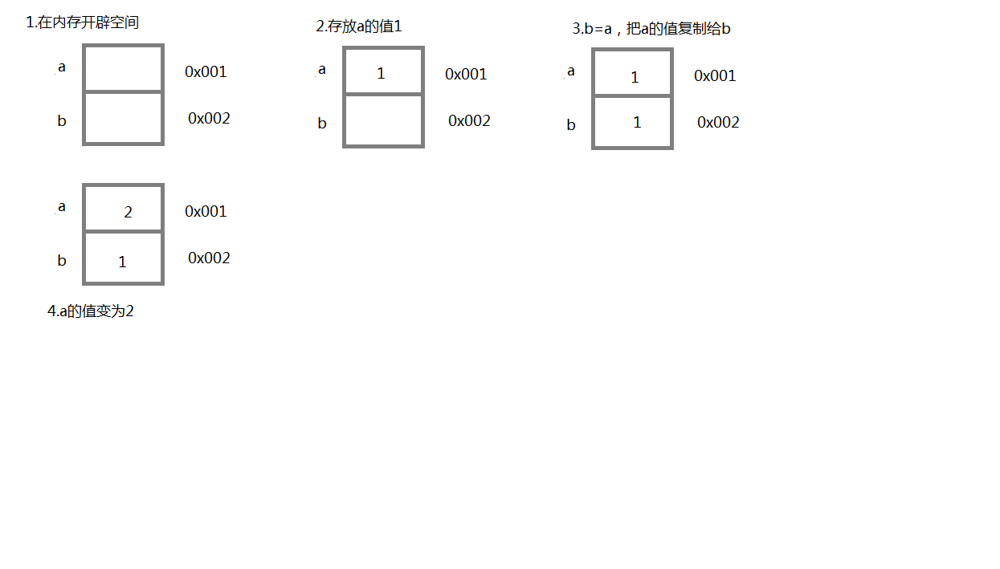
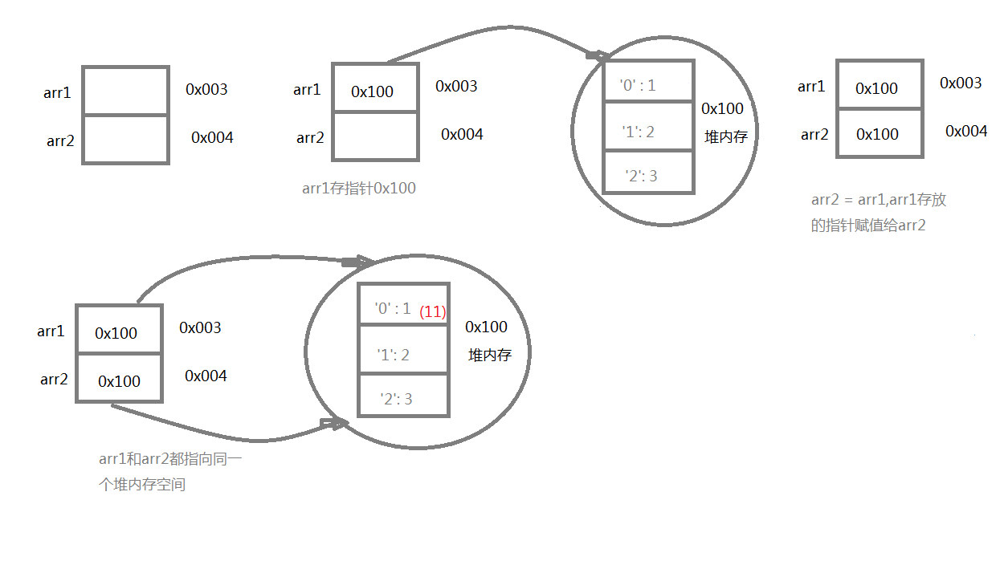

JavaScript有7种数据类型：number、string、boolean、undefined、null、symbol、object
## 原始类型
number、string、boolean、undefined、null、symbol。
变量在内存中按值存放，存放在栈内存中的简单数据段，可以直接访问。
## 引用类型
object：又分为普通对象、Array（特殊对象）、function（特殊对象）。
变量保存的是一个**指针（地址）**，这个指针指向另一个位置。当需要访问引用类型（如对象，数组等）的值时，首先从**栈中获得该对象的地址指针**，然后再从**堆内存中取得所需的数据**。

例子1：
```
var a = 1
var b = a
a = 2
console.log( b )  //1
```
## 解析
```
var a
var b

a = 1
b = a
a = 2
console.log( b )
```
内存图：


例子2：
```
var arr1 = [1, 2, 3]
var arr2 = arr1
arr1[0] = 11
console.log( arr2[0] )
```
## 解析
```
var arr1
var arr2

arr1 = [1, 2, 3]
arr2 = arr1
arr1[0] = 11
console.log( arr2[0] )
```
内存图：

