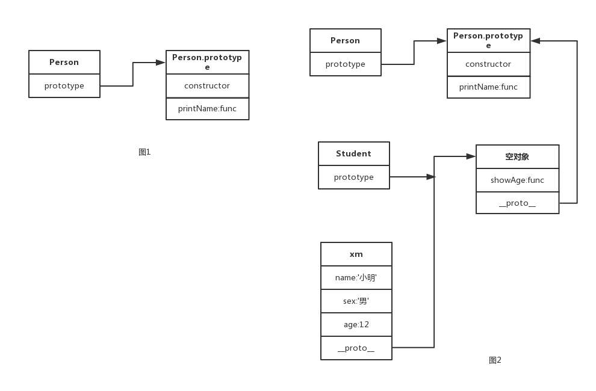

## 两种写法的区别
```
//方法1
function People(name, sex){
    this.name = name;
    this.sex = sex;
    this.printName = function(){
        console.log(this.name);
    }
}
var p1 = new People('校长', 50)

//方法2
function Person(name, sex){
    this.name = name;
    this.sex = sex;
}

Person.prototype.printName = function(){
    console.log(this.name);
}
var p1 = new Person('小明', 12);
```
1. 方法1创建的实例对象都有printName()方法，但作用都是一样的。每个实例都要重复一遍，大量对象存在会造成内存浪费。
2. 方法2中把printName方法存放到Person.prototype里，每个实例对象的__proto__都指向Person.prototype能访问到，减少了对象的使用。
## 继承
**使用Object.create实现类式继承**
```
function Person(name, sex){
    this.name = name;
    this.sex = sex;
}
Person.prototype.printName = function(){
    console.log(this.name);
}

function Student(name,sex,age){
    Person.call(this,name,sex);
    this.age = age;
}

Student.prototype = Object.create(Person.prototype)
Student.prototype.showAge = function(){
    console.log(`今年${this.age}岁`);
}

var xm = new Student('小明','男',12)
xm.printName();
xm.showAge()
```
原型图

- Person.call(this,name,sex)的作用：执行函数 Person(name, sex)，执行的过程中里面遇到 this 换成当前传递的 this，这里this就是Student的实例对象xm。
- Object.create(Person.prototype)的作用是：创建一个空对象，空对象的__proto__等于 Person.prototype

## 封装成一个函数
```
function inherit(base,child){
    var _prototype = Object.create(base.prototype);
    _prototype.constructor = child;
    child.prototype = _prototype;
}

function Person(name, sex){
    this.name = name;
    this.sex = sex;
}
Person.prototype.printName = function(){
    console.log(this.name);
}

function Student(name,sex,age){
    Person.call(this,name,sex);
    this.age = age;
}

inherit(Person,Student)
Student.prototype.showAge = function(){
    console.log(`今年${this.age}岁`);
}

var xm = new Student('小明','男',12)
xm.printName();
xm.showAge()
```
