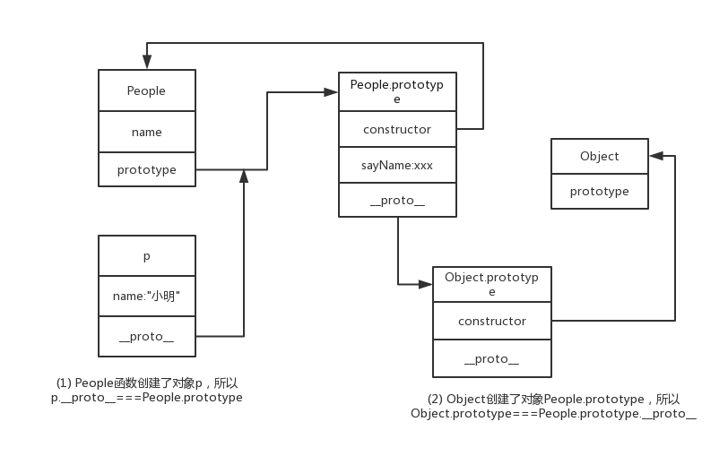

## 面向对象
典型的面向对象编程语言（比如 C++ 和 Java），存在“类”（class）这个概念。所谓“类”就是对象的模板，对象就是“类”的实例。JavaScript语言的对象体系，不是基于“类”的，而是基于构造函数（constructor）和原型链（prototype）。
JavaScript语言使用构造函数（constructor）作为对象的模板。所谓“构造函数”，就是专门用来生成“对象”的函数。它提供模板，描述对象的基本结构。一个构造函数，可以生成多个对象，这些对象都有相同的结构。
## 构造函数的特点有两个：
- 函数体内部使用了this关键字，代表了所要生成的对象实例。
- 生成对象的时候，必需用new命令，调用构造函数。
```
function Person(name){
    this.name=name;
    this.showName=function(){
        console.log(this.name);
    }
}
var p1 = new Person('李四')
p1.name
p1.showName()
```
## prototype 是什么？有什么特性
JavaScript的每个对象都继承另一个对象，后者称为“原型”（prototype）对象。只有null除外，它没有自己的原型对象。通过构造函数生成实例对象时，会自动为实例对象分配原型对象。
每一个构造函数都有一个prototype属性，这个属性就是实例对象的原型对象。原型对象也是对象，所以它也有自己的原型。
当实例对象本身没有某个属性或方法的时候，它会到构造函数的prototype属性指向的对象，去寻找该属性或方法。
原型对象的作用，就是定义所有实例对象共享的属性和方法。这也是它被称为原型对象的含义，而实例对象可以视作从原型对象衍生出来的子对象。
```
function People(name){
  this.name = name
}
People.prototype.sayName = function() {
    console.log(`my name is ${this.name}`)
}
var p = new People('小明')
p.sayName()
```
## 原型链
对象的属性和方法，有可能定义在自身，也有可能定义在它的原型对象。由于原型本身也是对象，又有自己的原型，所以形成了一条原型链（prototype chain）。
**“原型链”的作用是，读取对象的某个属性时，JavaScript 引擎先寻找对象本身的属性，如果找不到，就到它的原型去找，如果还是找不到，就到原型的原型去找。如果直到最顶层的Object.prototype（即Object构造函数的prototype属性）还是找不到，则返回undefined。**
Object.prototype对象的原型是null，由于null没有任何属性，所以原型链到此为止。

## 构造函数
prototype对象有一个constructor属性，默认指向prototype对象所在的构造函数。
```
function P() {}
P.prototype.constructor === P //true
```
constructor属性表示原型对象与构造函数之间的关联关系，如果修改了原型对象，一般会同时修改constructor属性，防止引用的时候出错。
__proto__属性（前后各两个下划线）可以改写某个对象的原型对象。

## 例子:解释People、 __proto__、p、constructor之间的关联。
```
function People(name){
  this.name = name
}
People.prototype.sayName = function() {
    console.log(`my name is ${this.name}`)
}
var p = new People('小明')
p.sayName()
```
1.声明构造函数People，自动获得属性prototype；
2.People.prototype也是一个对象，是生成实例对象 p 的原型对象；
3.People.prototype对象有一个constructor属性，指向构造函数People；
4.实例对象p有个属性__proto__,可以改写实例对象的原型对象；
```
People.prototype.constructor === People;
p.__proto__ === People.prototype
p.__proto__.constructor === People
```
## 上例中，对象 p可以这样调用 p.toString()。toString是哪里来的? 画出原型图?并解释什么是原型链。
- 对象p会在自己的属性和方法找，找到后就返回；
- 没有找到，通过p的__proto__属性，找到其原型对象Person.prototype，继续查找，找到就返回；
- 没有找到，通过prototype的__proto__属性找到顶层Object的prototype属性(任何类的prototype属性本质上都是个类Object的实例,所以prototype也和其它实例一样也有个__proto__内部属性，指向其类型Object的prototype),找到返回。

